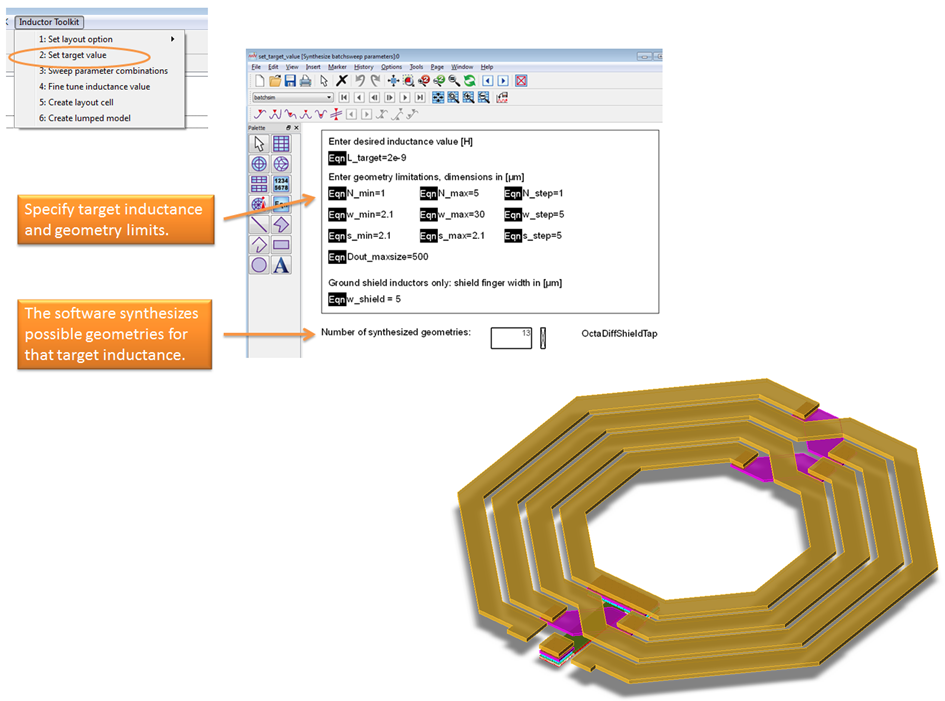
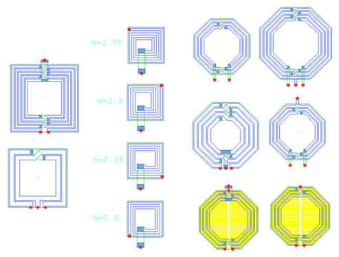
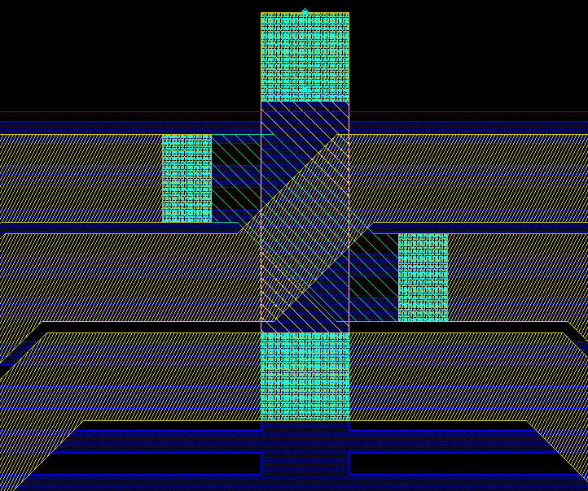
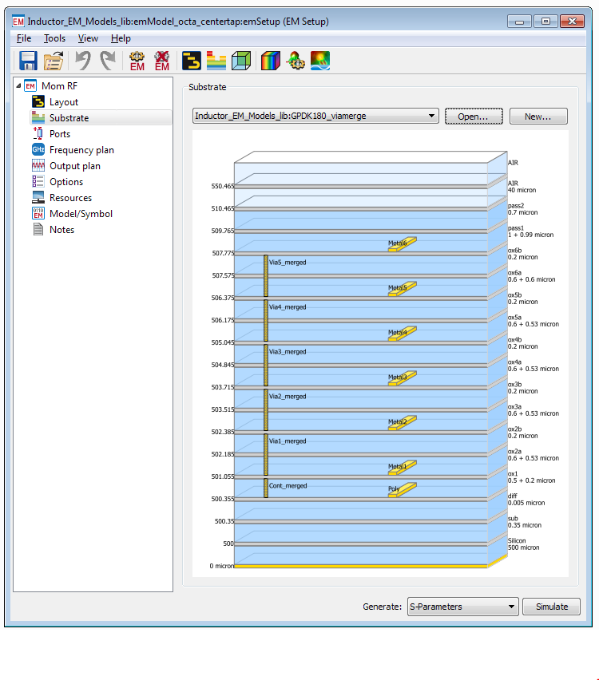
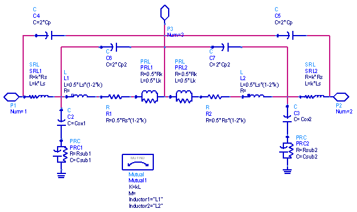
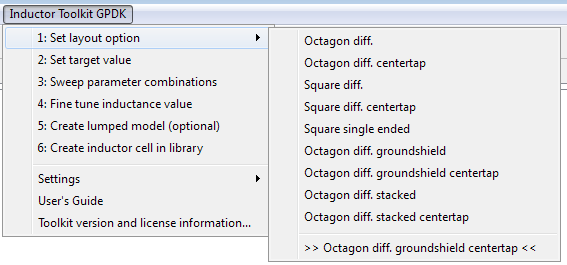
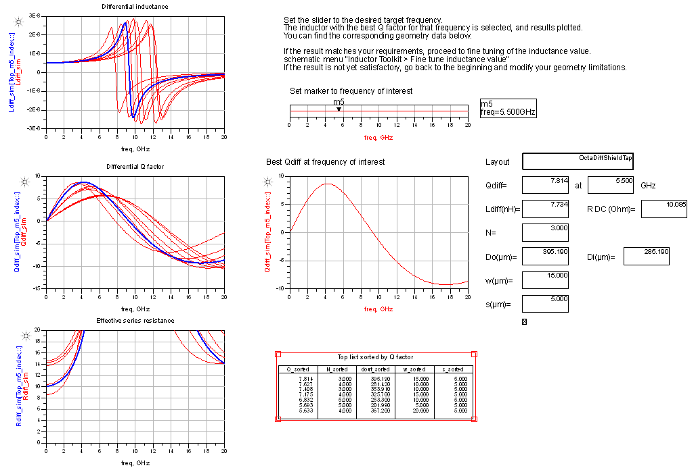
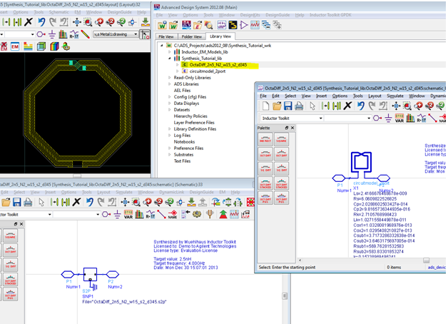

# RFIC Inductor Toolkit for ADS, Open Source Version

With ADS Momentum or Sonnet, you can EM simulate an RFIC on-chip inductor if the layout already exists, but how to design the best possible layout? How to find the best inductor layout for your requirements?

This RFIC Inductor Toolkit for ADS does that synthesis for you, and enables you to efficiently design “optimum” inductors.

Your input is the required inductance value and target frequency, as well as geometry limitations. Inductor Toolkit does the work for you: It automatically synthesizes and EM simulates the best possible layout for your requirements. You get DRC clean layout with best possible inductor, within the given geometry limits. You also get an equivalent circuit model and Spectre *.scs netlist file

## About

Mühlhaus RFIC Inductor Toolkit started as a commercial product. Since August 2025, it is now provided as Free Open Source Software under the MIT license. 

## Download of pre-configured PDK

RFIC Inductor Toolkit Open is pre-configured for the GPDK demo technology, it can be customized by the user to support other technologies. 

Download of the pre-configured ADS Designkit:
https://github.com/VolkerMuehlhaus/RFIC-Inductor-Toolkit-Open/tree/main/pdk_ready_for_use

## Available layout options

Layout options include symmetric octagon inductors, symmetric square inductor and asymmetric square inductors. The symmetric inductors are support in single layer configuration as well as stacked metal configuration. Patterned ground shield for reduced substrate coupling and increased Q factor is also available.

## DRC clean layout

When customized for the actual technology, all layouts are created DRC clean, with full details for via arrays etc. Technology specific layout options, such as via sizes and via spacing, are specified in a technology file. For EM simulation, the required via array simplification is handled automatically.

## EM accurate results

EM simulations are automated, with pre-configured substrates and emSetup/emModel elements. Once the customization for a technology is completed, the user does not need any EM expertise to use Inductor Toolkit for ADS. However, experienced users are able to customize the EM settings if they wish.

## Equivalent circuit model

For symmetric and asymmetric inductors, with or without center tap, an equivalent circuit model can be extracted, and exported to an *.scs netlist file. Equivalent circuit models are not yet available for inductors with patterned ground shield. These are only supported through S/Y/Z-parameter results.

Equivalent circuits models are stored as an ADS cell, and also in *.scs file format for use in Cadence Spectre.

# RFIC Inductor Toolkit Workflow

Here is a brief overview of the method, so that you can use Inductor Toolkit efficiently.

To synthesize an inductor, you first specify your target value for inductance, and some geometry limitations. With this data, possible implementations are calculated, which all result in this inductance value.

Next, all these implementations are EM simulated. EM simulation is done with Momentum RF mode, with a default mesh setting that is fast and reasonably accurate. The EM simulations use the same parametric emModel, which is  predefined in the PDK for different octagon inductor topologies (with/without center tap, normal or stacked metal, with/without ground shield). The advantage of using an emModel is that existing results are stored in a database, and can be reused for the same set of parameters, or reused for interpolating values that are close.

To speed up inductor synthesis, the result table of the emModel can be pre-computed across a range of common parameter values. This will take some hours or even days, but once this is done, results can be reused for later inductor simulations, greatly reducing the simulation time then.

Now that different results over a range of possible implementations are available, the data display template (evaluate_batchsweep) will plot inductor parameters for all these results, and pick the geometry that has performed best. Best performance is defined as the best Q factor at the frequency of interest. This frequency of interest is set by the user, with a slider on the data display.

Now the best implementation is selected, but the inductance might not be exactly the desired value at the frequency of interest. To adjust the value, the difference between target inductance and simulated inductance is calculated, resulting in the new, final inductor size. For that final inductor size, another EM simulation is started. After that simulation is finished, the final electrical parameters and geometry parameters are shown (evaluate_finetune).

Up to this point, all simulations had been done on a parametric layout, with parameters supplied as data tables. Now that we have determined the best dimensions,  a “static” cell with that exact geometry can be created.

Also, for geometries without ground shield, an equivalent circuit model can be fitted to the EM simulated data. This uses the ADS optimizer, but it is highly automated, so that you don’t need to set up anything yourself. You only need to start the optimizer and save back the optimized results. Results are shown in the data display (inductor_parameters_2port) and also written to a Spectre netlist file (*.scs) in the workspace data directory.

# Resources

Tutorial video: https://www.youtube.com/watch?v=m1ALwB42nEU

Technology customization: https://www.youtube.com/watch?v=7CD4_NomkIs&t=1s

# Availability

Download of the pre-configured ADS Designkit:
https://github.com/VolkerMuehlhaus/RFIC-Inductor-Toolkit-Open/tree/main/pdk_ready_for_use

# Copyrights and Trademarks

ADS is a trademark of Keysight technologies. This work was developed independently by Dr. Mühlhaus Consulting & Software GmbH.
